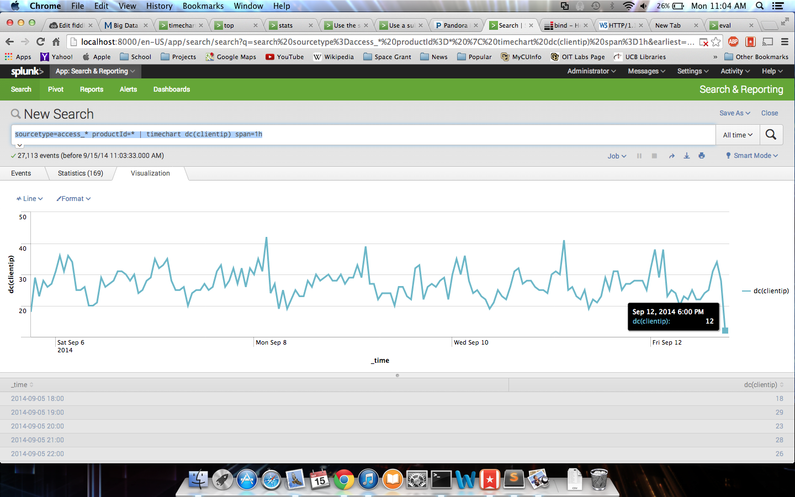

# Name

Sam Korn

# How many points have you earned?

0/100

(Make your own calculation and replace the number 0 with the points you think you've earned.)

# Splunk

## Checkpoint 1 (5 points)

## Checkpoint 2 (5 points)

## Checkpoint 3 (5 points)

## Checkpoint 4 (5 points)

## Study Questions (3 points x 4 = 12 points)

### Q1. (3 points)

### Q2. (3 points)
The HTTP status code 200 means that the request was OK and succeeded.

### Q3. (3 points)
In terminal commands the pipe character is often used when moving data between multiple commands. In Splunk the pipe serves a similar role to narrow down search results and visualize data.

### Q4. (3 points)
The reason why this information has to be retrieved through a raw search of logs is because for large companies keeping this information would take up a lot of data in a structural database. This way the information is always up to date when you are looking for data.

## Challenge 1 (2 points x 8 = 16 points)

### a.

Splunk Command: sourcetype=access_* | stats count

### b.

Splunk Command: sourcetype=access_* | stats count AS "Events"

### c.

Splunk Command: sourcetype=access_* | stats count as Events, count(eval(action="purchase")) as Purchases

### d.

Splunk Command: sourcetype=access_* | stats count as Events, count(eval(action="purchase")) as Purchases, count(eval(action="addtocart")) as AddToCarts, count(eval(action="remove")) as Removes

### e.

Splunk Command: sourcetype=access_* | stats max(bytes)

### f.

Splunk Command: sourcetype=access_* | stats max(bytes) as MAX

### g.

Splunk Command: sourcetype=access_* | stats max(bytes) as MAX, min(bytes) as MIN, mean(bytes) as MEAN

### h.

Splunk Command: sourcetype=access_* | stats dc(productId) as NumberOfUniqueProducts,values(productId) as UniqueProductIds

## Challenge 2 (2 points x 7 = 14 points)

### a. 

Splunk Command: sourcetype=access_* | top clientip

### b. 

Splunk Command: sourcetype=access_* date_wday!="sunday" date_wday != "saturday"| top date_wday limit=3

### c. 

Splunk Command: sourcetype=access_* | top productId

### d. 

Splunk Command: sourcetype=access_* date_wday="friday" | top productId

### e. 

Splunk Command: sourcetype=access_* date_wday="friday" action="purchase"| top productId

### f. 

Splunk Command: sourcetype=access_* action="purchase"| top productId limit=1

### g. 

Splunk Command: sourcetype=access_* action="purchase" | top productId limit=1 by date_wday

## Challenge 3 (2 points x 9 = 18 points)

### a. 

Splunk Command: sourcetype=access_* productId=* | timechart count

### b. 

Splunk Command: sourcetype=access_* productId=* | timechart dc(clientip)

### c. 

Splunk Command: sourcetype=access_* productId=* | timechart dc(clientip) span=1h

### d. 

Splunk Command: sourcetype=access_* productId=* | timechart count by host

### e. 

Splunk Command: sourcetype=access_* productId=* | timechart count by productId

### f. 

Splunk Command: sourcetype=access_* productId=* | timechart count by productId limit=16

### g. 

Splunk Command: sourcetype=access_* productId=* | timechart count by clientip

### h. 

Splunk Command: sourcetype=access_* productId=* | timechart useother=f count limit=10 by clientip

### i. 

Splunk Command: sourcetype=access_* productId=* | timechart span=1h sum(bytes)

## Challenge 4 (4 points x 2 = 8 points)

### a.

Splunk Command: sourcetype=access_* | rex "(?<mymethod>POST)"| rex "(?<mymethod>GET)"|
     table mymethod, method, _raw

### b.

Splunk Command: sourcetype=access_* action | rex "(GET|POST) /cart.do\?action=(?<myaction>\w+[^&])" | table myaction, action, _raw